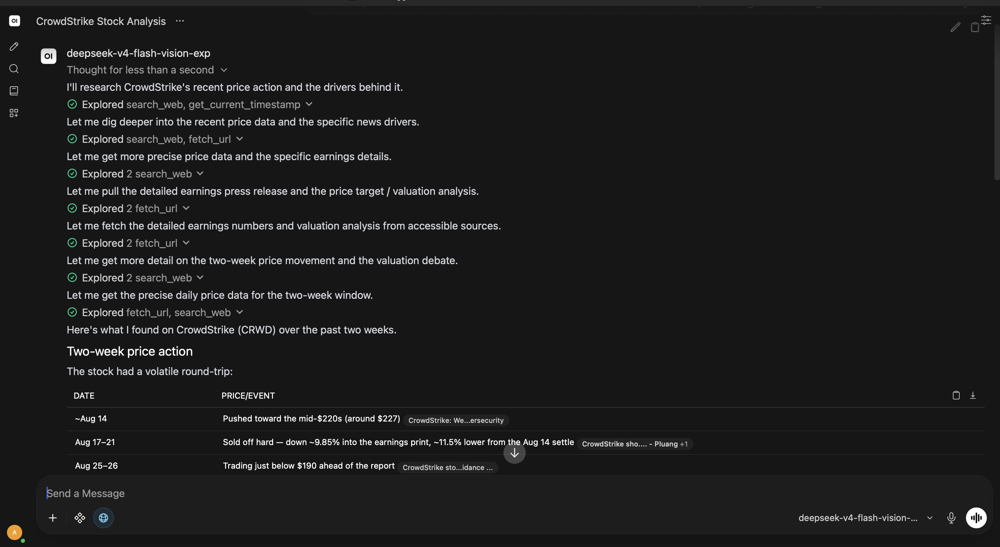
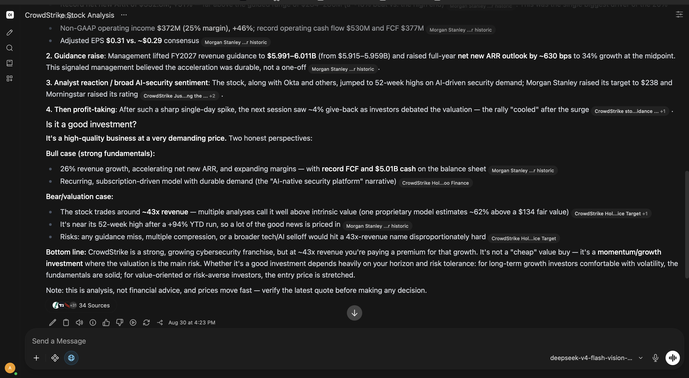

The goal was simple: I wanted my AI setup to behave like the rest of my
homelab. Self-hosted, reachable from any device over my tailnet, private
by default, and without a fixed monthly bill.

I was a paying Claude user, and the product is good. But twenty euros a
month whether I use it or not, plus a five hour usage window, started to
feel like renting something I could own.

## The model: vision was the hard part

Coding and text I could already get cheap. Vision was the requirement
that kept me on Claude: screenshots, architecture diagrams, error dumps.

Then I found deepseek v4 flash vision. DeepSeek claims vision performance
on par with claude opus 4.8, and in my day to day (UI screenshots, photos
of whiteboards, pasted logs) that matched what I saw. That was the moment
the subscription stopped being necessary.

## The web search bake-off

With the model sorted I got greedy: claude's web search is genuinely
useful, and I wanted it too. Maybe even better, since I would control the
pipeline.

Web search in openwebui splits into two decisions: who searches, and who
reads the pages. On the search side I compared the hosted options
(linkup, tavily) against self-hosting searxng. On the loader side:
playwright, firecrawl, and the newer projects like crawl4ai.

They are all good products, and several even come with a free monthly
quota. The catch is what "free" means when your agent hunts in swarms: a
single research question fans out into a dozen queries, and each of
those fans out into pages to read. Quotas are priced for a person
searching, not for a model that searches in swarms. The moment usage
spikes, the free tier is gone and you are back on a metered bill.

So the filter wrote itself: open source, free, running on my hardware,
and customizable in ways a hosted API can never be.

- searxng as the metasearch engine: no API key, no quota, no per-call
  cost. I choose which engines it queries, how they are weighted, the
  language and region, and it returns clean JSON the model can digest.
- playwright as the loader: full JavaScript rendering, which is what
  most modern pages need before a model can read them, plus control over
  waits, scrolling and extraction.

Paired together they do the job very well, and the customization is the
part a hosted API can never replicate: I decide how the web is searched
and how it is read.

### Two real tests

The first: check crowdstrike's share price over the last week and what
drove the changes. The pipeline searched, playwright pulled the market
pages that actually render the numbers, and the model laid out the move
alongside the news that drove it. The kind of multi-step research that
used to mean opening twenty tabs.

*The tool calls: searxng searching, playwright reading the pages.*

*The reply: what drove the move, the bull vs bear verdict, and the 34 sources behind it.*

The second is ongoing: I am applying to startups and scaleups, and
before I get excited about a company I want its financial numbers and
who backs whom. Investors, rounds, runway. The same pipeline digs
through funding pages and company sites so I can tell a healthy place
with a nice future from one that is burning out.

I am still tuning it: engine weights in searxng, playwright timeouts,
and how aggressive the page-to-text step should be.

## The money part

I will be honest about the trigger: I am kind of broke right now, and a
fixed monthly AI subscription is a bad deal when usage is spiky.

The deepseek platform is pay as you go: I load credits and spend them
when I want. Compared to the fixed twenty euros, it runs me about half or
less even with heavy usage, and there is no five hour window. Small
difference on paper, big difference for a fresh graduate in between
interviews.

## Why this matters beyond me

Self-hosted openwebui, a credits-based model with vision, and my own web
search now replace my claude workflow: the same access from any device
over tailnet, data that never leaves my network, and a cost that follows
usage instead of a calendar.

I saw the fixed-cost side up close: at a previous employer, every single
employee had a Claude seat at a flat twenty euros a month. Multiply that
per seat and the bill gets serious, and I am convinced a properly
implemented version of this setup would cut that cost considerably.

At company scale this pattern works, if done properly: openwebui behind
authentik for SSO, models billed as credits or self-hosted, and search on
an internal searxng instance. The saving multiplies per employee, and the
data stays inside the perimeter. That is a platform engineering project
worth making, not a hack.

The honest tradeoffs: things like cowork-style collaboration and how
intuitive Claude Desktop feels set a high bar for any replacement. But
the direction is clear. Governments are already moving to self-hosted,
openwebui-style deployments, and the EU keeps reinforcing the open source
ecosystem. It is a matter of time before flat-rate AI seats become
unsustainable and the open alternatives take off.
