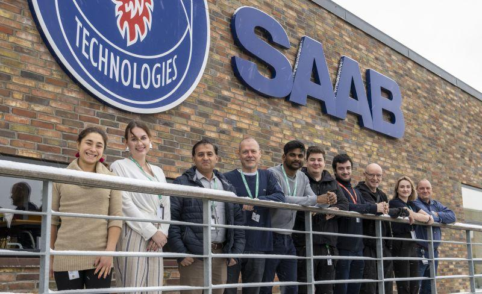

*La foto dei nuovi assunti all'ingresso di Sønderborg. Sono il settimo partendo da sinistra.*

> 🔒 **Nota NDA:** i dettagli oltre a quelli mostrati qui sono limitati da un NDA ancora in vigore. Tutto ciò che è pubblicato in questa pagina è condivisibile apertamente.

> ✍️ **Analisi dettagliata in preparazione.**
